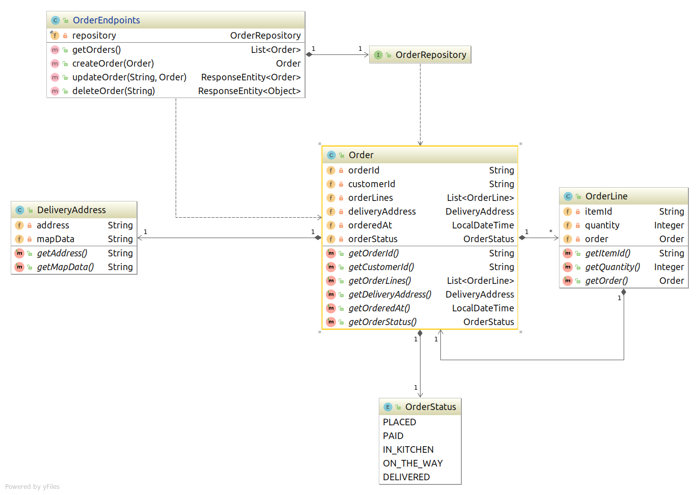

== Background

This example shows how to integrate performance benchmark metrics with cicd pipeline for tomcat.

== Domain Class Diagram

== Ci/Cd

On this example, i will use circle ci for the pipeline.

. Build [ Compile -> Run Unit Tests -> Build Artifacts ]

. Publish container image

. Deploy for staging

. Run benchmark testing & Publish benchmark metrics

. Cleanup staging deployment
